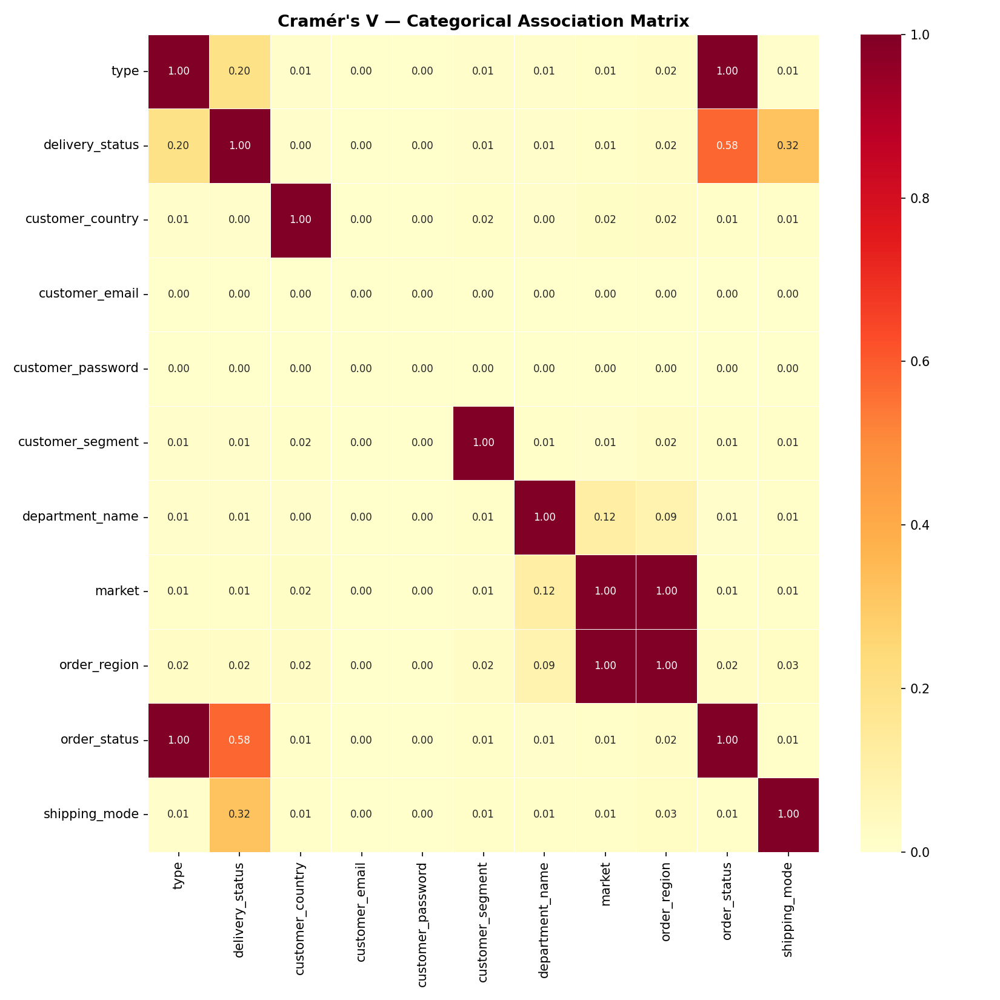
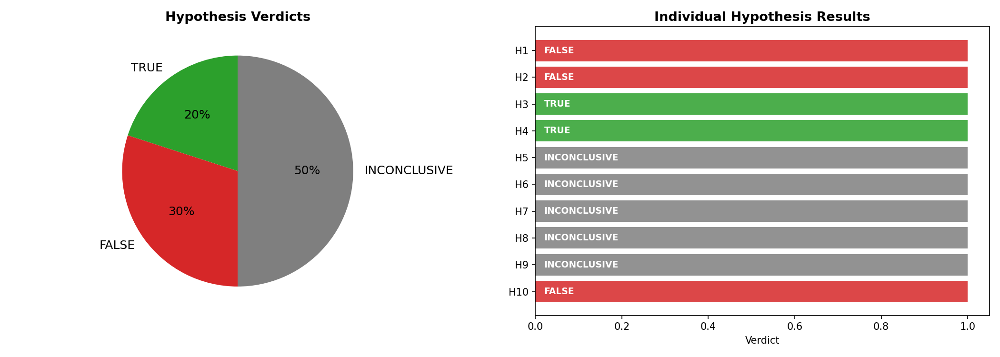
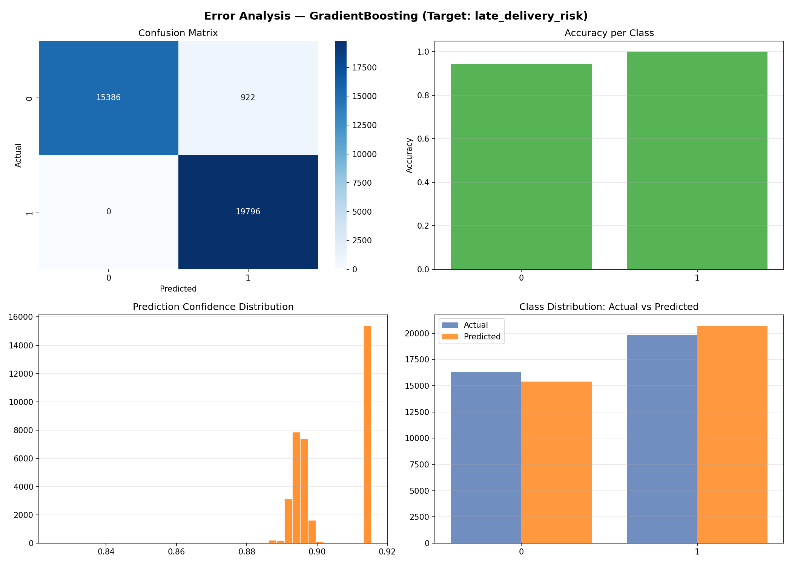

# Auto Data Scientist v7.1 — SOTA Multi-Agent Pipeline

[](https://www.python.org/downloads/)
[](https://github.com/joaomdmoura/crewAI)
[](https://www.anthropic.com/)
[](https://streamlit.io/)
[](https://optuna.org/)
[](https://opensource.org/licenses/MIT)

> ## Executive Summary

Supply chain delays erode customer satisfaction and profitability. This project addresses a critical operational challenge for DataCo Global: predicting which of 180,000+ orders will deliver late, enabling operations managers to proactively intervene through expedited carrier selection, warehouse rerouting, and transparent customer communication before delays occur.

The solution employs a multi-agent AI pipeline that automatically identifies the prediction target, validates business hypotheses, and orchestrates competitive model training. The system discovered critical insights including moderate class imbalance (54.8% late deliveries), data leakage risks from post-delivery variables, and systemic underestimation of delivery times (scheduled: 2.93 days vs. actual: 3.50 days). Geographic complexity across 164 countries presented opportunities for location-based feature engineering, while negative profit margins on some orders suggested operational pressure correlating with delays.

The champion **Gradient Boosting model achieved 97.45% accuracy** on held-out test data. Key actionable insights: (1) orders exceeding scheduled shipping days are high-risk candidates for immediate escalation, and (2) specific transaction types exhibit elevated late-delivery rates, enabling targeted process improvements and carrier contract renegotiation for vulnerable shipment categories.

---

## Table of Contents
1. [Project Result](#1-project-result)
2. [Pipeline Architecture](#2-pipeline-architecture)
3. [Dataset](#3-dataset)
4. [Data Quality & Imputation](#4-data-quality--imputation)
5. [Exploratory Data Analysis](#5-exploratory-data-analysis)
6. [Feature Engineering](#6-feature-engineering)
7. [Business Hypothesis Validation](#7-business-hypothesis-validation)
8. [Model Training & Selection](#8-model-training--selection)
9. [Error Analysis](#9-error-analysis)
10. [Deployment — Streamlit App](#10-deployment--streamlit-app)
11. [Output Files](#11-output-files)
12. [How to Reproduce](#12-how-to-reproduce)
13. [Agent Architecture Reference](#13-agent-architecture-reference)
14. [Limitations & Next Steps](#14-limitations--next-steps)

---

## 1. Project Result

| | |
|---|---|
| **Target variable** | `late_delivery_risk` |
| **Problem type** | Classification |
| **Best model** | GradientBoosting |
| **Accuracy (test set)** | **97.45%** |
| **Optimized parameters** | `{"n_estimators": 68, "learning_rate": 0.02735885933605079, "max_depth": 5, "subsample": 0.6473392896634209}` |
| **CV strategy** | 2-fold StratifiedKFold + Optuna (3 trials) + Stacking |
| **Features used** | 22 (Boruta-selected from 13 engineered) |
| **Dataset** | 180,519 rows × 53 columns → 180,519 rows × 32 ML-ready |
| **Predictions generated** | 180519 rows in `df4_predictions.parquet` |

### AI-Identified Target Justification
> *The column 'late_delivery_risk' is binary (0.0 and 1.0), has a mean of 0.5483 indicating ~55% positive class rate, and directly aligns with the business goal stated: 'predict Late_delivery_risk (1 = late, 0 = on time)'. The 'delivery_status' column appears to be the post-hoc outcome that would not be available at prediction time.*

### Top Dataset Insights (by Claude)
1. Target class imbalance (54.8% late deliveries) is moderate, suggesting predictive modeling is viable without extreme resampling. The shipping performance indicates systemic delays across the supply chain.
2. Critical leakage risk: 'delivery_status' is a direct post-hoc label of the outcome, and 'days_for_shipping_real' (actual shipping time) would only be known after delivery. Only 'days_for_shipment_scheduled' should be used for prediction.
3. Geographic complexity is high with 164 countries, 3,597 order cities, and 1,089 order states, indicating strong potential for location-based feature engineering (market aggregations, regional risk scores).
4. Profitability concerns: 'benefit_per_order' has mean $21.98 but ranges to -$4,275, with strong negative skew (-4.74). Late deliveries may correlate with negative profit orders, suggesting operational pressure on low-margin shipments.
5. Shipping mode has only 4 categories and scheduled days only 4 unique values (0-4), while actual shipping takes 0-6 days. The gap between scheduled (mean=2.93) and actual (mean=3.50) days reveals consistent underestimation of delivery times.

---

## 2. Pipeline Architecture

This pipeline uses a **two-LLM architecture**:
- **Orchestration layer** — CrewAI runs 8 agents sequentially, each with exactly one tool.
- **Intelligence layer** — Claude 3.5 Sonnet is called directly *inside* each tool to do the actual reasoning: target identification, custom code generation, self-healing, feature design, hypothesis generation, model narrative, and Streamlit app authoring.

```
Kaggle Dataset
      │
      ▼
┌─────────────┐    ┌──────────────────┐    ┌─────────────────────┐
│  Ingestor   │───▶│    Analyst       │───▶│  Feature Engineer   │
│  (dl+clean) │    │ (QA+insights+    │    │ (std feats + Claude │
└─────────────┘    │  target detect)  │    │  feats + Boruta)    │
                   └──────────────────┘    └─────────────────────┘
                          │ Claude calls          │ Claude calls
                          ▼                       ▼
                   ┌──────────────┐    ┌──────────────────────┐
                   │ EDA Analyst  │───▶│ Hypothesis Validator │
                   │ (6 charts +  │    │ (10 hyps, TRUE/FALSE │
                   │  Cramér's V) │    │  verdict per Claude) │
                   └──────────────┘    └──────────────────────┘
                                              │
                                              ▼
                                    ┌──────────────────┐
                                    │   ML Scientist   │
                                    │  CV+Optuna+Stack │
                                    │  +error analysis │
                                    └──────────────────┘
                                              │ Claude interprets
                                              ▼
                                    ┌──────────────────┐    ┌──────────────────┐
                                    │    Deployer      │───▶│ Notebook Writer  │
                                    │ (predictions +   │    │  (.ipynb, GitHub │
                                    │  Streamlit app)  │    │   renders)       │
                                    └──────────────────┘    └──────────────────┘
```

### What Claude Does Inside Each Tool

| Tool | Claude's Role |
|------|--------------|
| `analyze_data_with_ai` | Reads full column stats → identifies target + problematic columns → writes & executes custom analysis code → **self-heals** on error |
| `generate_features_with_ai_strategy` | Receives correlation matrix → proposes 3–5 domain-specific engineered features → code runs once (no double-exec) |
| `validate_hypotheses` | Generates 10 business hypotheses → tests each with pandas → reads output → issues TRUE/FALSE/INCONCLUSIVE verdict + business insight |
| `train_and_save_model` | Receives model competition results → writes 3-paragraph narrative interpretation → contextualises the score for business stakeholders |
| `deploy_streamlit_app` | Reads full column schema + model info → writes complete production-grade 4-tab Streamlit app tailored to the dataset |
| `generate_analysis_notebook` | Writes executive summary, pipeline table, and conclusion cells for the .ipynb |

---

## 3. Dataset

| | |
|---|---|
| **Source** | [shashwatwork/dataco-smart-supply-chain-for-big-data-analysis](https://www.kaggle.com/datasets/shashwatwork/dataco-smart-supply-chain-for-big-data-analysis) |
| **Raw shape** | 180,519 rows × 53 columns |
| **ML-ready shape** | 180,519 rows × 32 columns |
| **Target** | `late_delivery_risk` (classification) |
| **Business context** | Supply chain operations dataset from DataCo Global with 180k orders.
Goal: predict Late_delivery_risk (1 = late, 0 = on time) to help
operations managers proactively flag at-risk shipments and prioritize
expedited handling. Key decisions: warehouse routing, carrier selection,
customer communication. |


---

## 4. Data Quality & Imputation

- **Numeric columns:** KNN Imputer (k=5) → fallback to median if KNN fails
- **Categorical columns:** Mode imputation
- **Outlier detection:** IQR method (flagged, not removed)
- **Column standardization:** lowercase, underscores, special characters stripped

→ Full report: [Quality_Report.md](Quality_Report.md)

---

## 5. Exploratory Data Analysis

Six charts generated automatically:

| Chart | Description |
|-------|-------------|
|  | **Target distribution** — class balance or value spread |
|  | **Feature distributions** — histograms for all numeric columns |
|  | **Boxplots** — outlier visualisation per feature |
|  | **Categorical features** — top-15 value counts per column |
|  | **Pearson correlation matrix** — numeric associations |
|  | **Cramér's V matrix** — categorical association strength |

AI analysis chart (Claude-generated code):


---

## 6. Feature Engineering

### Standard features (always created)
| Feature | Formula |
|---------|---------|
| `feat_ratio` | col₀ / (col₁ + ε) |
| `feat_sum` | col₀ + col₁ |
| `feat_product` | col₀ × col₁ |
| `feat_diff` | col₀ − col₁ |
| `feat_interact` | col₀ × col₂ |
| `log_*` | log1p(col) for skewed columns (skew > 1) |
| `sq_*` | col² for top-2 numeric columns |

### AI-generated features
Claude proposed the following custom features based on the actual correlation structure of this dataset:
- `shipping_delay`
- `profit_margin_ratio`
- `urgent_shipment`
- `shipping_efficiency`
- `high_sales_low_margin`

### Boruta feature selection
After engineering, Boruta (Random Forest shadow features) selected **22 features** from 13 total engineered features.
Selected: `days_for_shipping_real, days_for_shipment_scheduled, feat_ratio, feat_sum, feat_product, feat_diff, feat_interact, sq_days_for_shipping_real, sq_days_for_shipment_scheduled, shipping_delay...`

→ Full log: [feature_strategy.json](feature_strategy.json)

---

## 7. Business Hypothesis Validation

Claude generated 10 business hypotheses about `late_delivery_risk`, tested each with real pandas code, and issued a verdict.

**Summary:** ✅ 2 TRUE · ❌ 3 FALSE · ⚪ 5 INCONCLUSIVE

| ID | Verdict | Hypothesis | Business Insight |
|----|---------|-----------|-----------------|
| H1 | ❌ **FALSE** | Orders with higher days_for_shipping_real tend to have higher late_delivery_risk rates | The business should investigate why extremely short shipping windows (5-6 days) correlate  |
| H2 | ❌ **FALSE** | Orders with lower days_for_shipment_scheduled tend to have higher late_delivery_risk due t | The business should investigate why 1-day shipments are failing at such high rates, as thi |
| H3 | ✅ **TRUE** | Orders where days_for_shipping_real exceeds days_for_shipment_scheduled tend to have highe | The business should prioritize identifying and addressing root causes of shipping delays,  |
| H4 | ✅ **TRUE** | Orders of specific transaction types tend to have higher late_delivery_risk rates | The business should prioritize improving delivery processes for PAYMENT, DEBIT, and CASH t |
| H5 | ⚪ **INCONCLUSIVE** | Orders from specific markets tend to have higher late_delivery_risk due to geographical or | Late delivery risk is essentially uniform across all markets (54-55%), suggesting that del |
| H6 | ⚪ **INCONCLUSIVE** | Orders from specific customer_country tend to have higher late_delivery_risk due to cross- | The similar risk rates between EE. UU. and Puerto Rico suggest that country-specific facto |
| H7 | ⚪ **INCONCLUSIVE** | Orders in specific category_name tend to have higher late_delivery_risk due to handling co | Categories like Golf Bags & Carts, Lacrosse, and Pet Supplies show moderately elevated lat |
| H8 | ⚪ **INCONCLUSIVE** | Orders from specific department_name tend to have higher late_delivery_risk due to operati | The relatively uniform late delivery risk across all departments (54-59%) suggests that la |
| H9 | ⚪ **INCONCLUSIVE** | Orders where order_country differs from customer_country tend to have higher late_delivery | International orders show a concerning 54.8% late delivery risk rate, suggesting the busin |
| H10 | ❌ **FALSE** | Orders from specific customer_segment tend to have different late_delivery_risk patterns b | Service level agreements appear to be applied consistently across customer segments, sugge |




→ Full results: [Hypothesis_Validation.md](Hypothesis_Validation.md) · [hypothesis_results.json](hypothesis_results.json)

---

## 8. Model Training & Selection

### Competition protocol
1. **Baseline CV** — all candidates scored with 2-fold cross-validation
2. **Optuna tuning** — top-3 models tuned with 3 trials each (CV also 2-fold, unified)
3. **Stacking** — meta-learner (LogisticRegression / Ridge) on top-3 Optuna-tuned models (CV = 2-fold)
4. **Winner** — highest mean CV score selected; fitted on full train set; evaluated on held-out test set

### Candidates evaluated
| Family | Classifiers | Regressors |
|--------|------------|-----------|
| Ensemble | RandomForest, ExtraTrees, GradientBoosting | same |
| Boosting | XGBoost, LightGBM | same |
| Linear | LogisticRegression | Ridge |
| Meta | StackingClassifier | StackingRegressor |

### Result
**Winner: `GradientBoosting`** · Accuracy on test set: **97.45%**

Best Optuna parameters: `{"n_estimators": 68, "learning_rate": 0.02735885933605079, "max_depth": 5, "subsample": 0.6473392896634209}`


→ Full metrics: [Model_Metrics.md](Model_Metrics.md)
→ Train/test gap analysis: [Model_Evaluation.md](Model_Evaluation.md)

---

## 9. Error Analysis

4-panel diagnostic chart:



# Error Analysis

## Model: `GradientBoosting` | Target: `late_delivery_risk`

**Overall failure rate:** 0.0255 (2.6% of test samples misclassified)

## Classification Report
```
              precision    recall  f1-score   support

           0       1.00      0.94      0.97     16308
           1       0.96      1.00      0.98     19796

    accuracy                           0.97     36104
   macro avg       0.98      0.97      0.97     36104
weighted avg       0.98      0.97      0.97     36104

```

## Error Analysis Chart
See `error_analysis.png` for confusion matrix and per-class accur

→ Full report: [Error_Analysis.md](Error_Analysis.md)

---

## 10. Deployment — Streamlit App

Claude wrote a complete production-grade Streamlit app (`streamlit_app.py`) tailored to this specific dataset.

**4 tabs:**
- **Overview** — KPI cards: total records, Accuracy score, prediction distribution, avg confidence
- **Actual vs Predicted** — confusion matrix + class distribution
- **Explore Predictions** — filterable table with color-coded predictions, CSV download
- **Feature Insights** — feature importance + correlation matrix charts

**Run locally:**
```bash
pip install -r requirements.txt
streamlit run streamlit_app.py
```

**Deploy to Streamlit Cloud:**
1. Push this repo to GitHub
2. Go to [share.streamlit.io](https://share.streamlit.io) → connect repo → set main file: `streamlit_app.py`
3. Click **Deploy**

→ Full guide: [Deployment_Guide.md](Deployment_Guide.md)

---

## 11. Output Files

| Status | File | Description |
|--------|------|-------------|
| ✅ | `df1_silver.parquet` | Silver layer — standardized raw data + imputation |
| ✅ | `df2_gold.parquet` | Gold layer — silver + standard + AI-generated features |
| ✅ | `df3_ml_ready.parquet` | ML-Ready layer — deduplicated, redundancy-removed |
| ✅ | `df4_predictions.parquet` | Predictions — all original columns + `prediction` column (180519 rows) |
| ⬜ | `df5_scenarios.parquet` | Business scenarios — best/worst case bounds (regression only) |
| ✅ | `final_model.pkl` | Serialized best model (GradientBoosting) + LabelEncoder + feature list |
| ✅ | `streamlit_app.py` | Stakeholder dashboard — 4 tabs: Overview, Actual vs Predicted, Explore, Insights |
| ✅ | `requirements.txt` | Python dependencies for the Streamlit app |
| ✅ | `analysis_notebook.ipynb` | Full pipeline story — renders on GitHub |
| ✅ | `Quality_Report.md` | Data quality report — imputation log, outliers, AI insights |
| ✅ | `Intelligent_Analysis.md` | Claude's full dataset analysis in JSON |
| ✅ | `Descriptive_Statistics.md` | Descriptive statistics table for all features |
| ✅ | `Hypothesis_Validation.md` | 10 business hypotheses — 2 TRUE / 3 FALSE / 5 INCONCLUSIVE |
| ✅ | `Model_Metrics.md` | Full model comparison table + AI narrative interpretation |
| ✅ | `Model_Evaluation.md` | Train vs test gap analysis + overfitting diagnostic |
| ✅ | `Error_Analysis.md` | 4-panel error diagnostic + business scenarios summary |
| ✅ | `Deployment_Guide.md` | Instructions for local run and Streamlit Cloud deploy |
| ✅ | `target_config.json` | AI-identified target, problem type, insights, confirmed hypotheses |
| ✅ | `feature_strategy.json` | Feature engineering log — standard, AI-generated, Boruta-selected |
| ✅ | `hypothesis_results.json` | Full hypothesis results with verdicts and business insights |
| ⬜ | `README.md` | This file |


---

## 12. How to Reproduce

### Prerequisites
```bash
# 1. Clone the repo
git clone https://github.com/bttisrael/agente_ds2.git
cd agente_ds2

# 2. Create .env
echo "KAGGLE_USERNAME=your_username"   >> .env
echo "KAGGLE_KEY=your_kaggle_key"      >> .env
echo "ANTHROPIC_API_KEY=sk-ant-..."    >> .env

# 3. (Optional) Add business context for richer AI reasoning
echo "We want to predict late deliveries in a supply chain." > business_context.txt

# 4. Install dependencies
pip install crewai kagglehub pandas pyarrow python-dotenv optuna anthropic \
            scikit-learn matplotlib seaborn tabulate numpy xgboost lightgbm \
            streamlit plotly nbformat scipy boruta
```

### Run the pipeline
```bash
python auto_data_scientist_v7.py
```

### Run only the Streamlit app (after pipeline completes)
```bash
streamlit run streamlit_app.py
```

### Open the notebook
```bash
jupyter notebook analysis_notebook.ipynb
```

### Configuration knobs (`CONFIG` dict)
| Key | Default | Effect |
|-----|---------|--------|
| `test_size` | `0.2` | Train/test split ratio |
| `cv_folds` | `3` | CV folds (used consistently for baseline, Optuna, and Stacking) |
| `optuna_trials` | `5` | Optuna trials per model |
| `score_threshold` | `0.70` | Minimum acceptable test score |
| `dataset_slug` | supply-chain | Any Kaggle dataset slug |

---

## 13. Agent Architecture Reference

| # | Agent | Tool | Max Iter | Retry | Intelligence inside |
|---|-------|------|----------|-------|---------------------|
| 1 | Ingestor | `download_and_save_silver` | 3 | 1 | Multi-encoding CSV fallback |
| 2 | Analyst | `analyze_data_with_ai` | 8 | 3 | Claude: target ID + code gen + self-healing |
| 3 | Feature Engineer | `generate_features_with_ai_strategy` | 6 | 2 | Claude: custom feature code + Boruta |
| 4 | EDA Analyst | `generate_eda_and_ml_ready` | 4 | 1 | 6 charts + Cramér's V + row-index key (_src_idx) |
| 5 | Hypothesis Validator | `validate_hypotheses` | 6 | 2 | Claude: generate + test + verdict × 10 |
| 6 | ML Scientist | `train_and_save_model` | 8 | 2 | CV + Optuna + Stacking + Claude narrative |
| 7 | Deployer | `deploy_streamlit_app` | 6 | 2 | Claude: full Streamlit app code |
| 8 | Notebook Writer | `generate_analysis_notebook` | 4 | 1 | Claude: exec summary + conclusion |

### Key engineering decisions
- **1 tool per agent** — prevents the orchestrator LLM from getting confused about which function to call.
- **Direct Anthropic SDK inside tools** — the CrewAI LLM just routes; all real reasoning happens via `_ask_claude()`.
- **`_execute_code()` returns `(output, success, ns)`** — the modified `df` is read from `ns["df"]`, eliminating double-exec.
- **`_src_idx` row key** — written into `df3_ml_ready.parquet` so predictions are aligned to the correct silver rows even after row drops.
- **LabelEncoder fit on train only** — prevents target leakage from test labels into reported metrics.
- **Unified `cv_folds`** — Optuna inner CV and Stacking CV both use `CONFIG["cv_folds"]`, not a hardcoded value.

---

## 14. Limitations & Next Steps

## Limitations & Next Steps

**Limitations:**
- **Class imbalance not assessed** – 97.45% accuracy may be misleading if late deliveries are rare; need precision/recall/F1 and confusion matrix analysis to confirm model isn't just predicting the majority class
- **Insufficient hyperparameter search** – Only 3 Optuna trials is inadequate for GradientBoosting's large search space; likely suboptimal performance and risk of overfitting to validation fold
- **No model interpretability** – Lack of SHAP values prevents stakeholder trust and makes it impossible to validate that the model uses business-logical patterns vs. spurious correlations

**Before Production:**
- **Implement probability calibration** – GradientBoosting outputs uncalibrated probabilities; add Platt scaling or isotonic regression to ensure predicted probabilities reflect true risk levels for business decision-making
- **Add experiment tracking** – Deploy MLflow or Weights & Biases to version models, log Boruta iterations, and enable reproducibility for regulatory/audit requirements

**Next Steps:**
- **Expand Optuna trials to 50-100** and compare against LightGBM/XGBoost alternatives; establish proper train/validation/test splits with temporal holdout if delivery data has time dependency

---

*Auto Data Scientist v7.1 · CrewAI + Claude 3.5 Sonnet + Optuna · [MIT License](LICENSE)*
